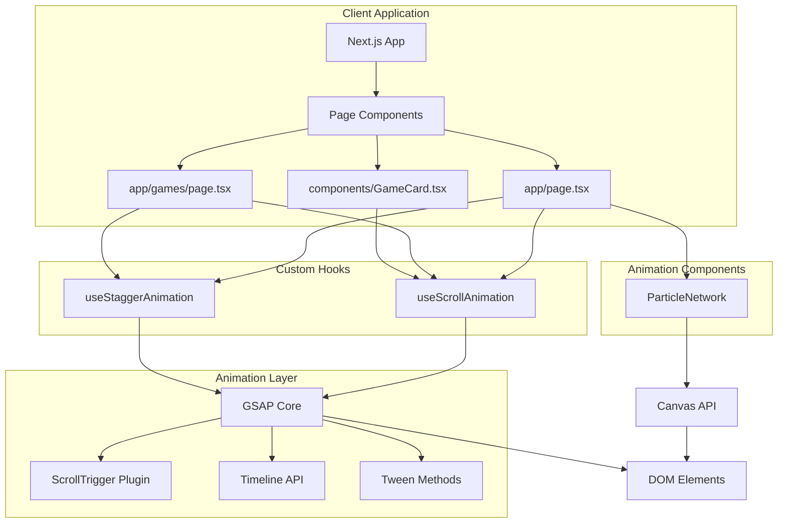
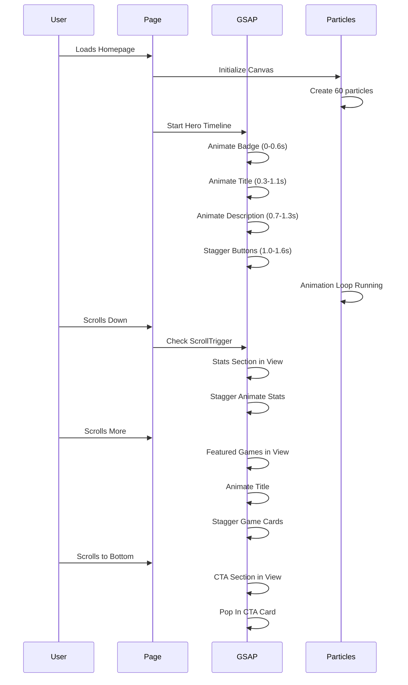
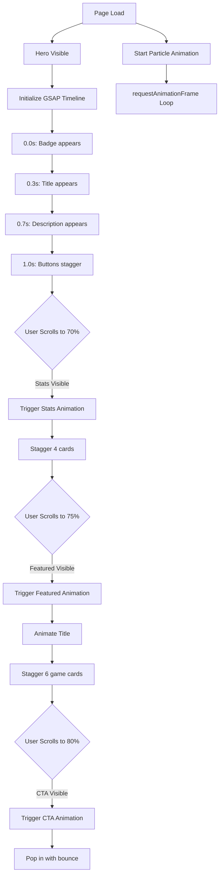
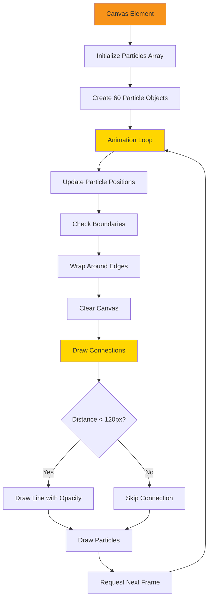
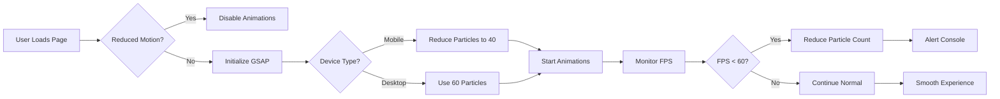

# Animation Architecture Overview

## System Architecture



## Animation Timeline Flow



## Page Block Animation Map

```mermaid
graph TD
    subgraph Hero["Hero Section - Timeline Animation"]
        H1[Badge: Fade In from Top]
        H2[Title: Slide Up + Fade In]
        H3[Description: Slide Up + Fade In]
        H4[Buttons: Stagger Slide Up]
        H5[Particle Network: Continuous]
        
        H1 --> H2
        H2 --> H3
        H3 --> H4
    end
    
    subgraph Stats["Stats Ticker - Scroll Triggered"]
        S1[Stat Card 1]
        S2[Stat Card 2]
        S3[Stat Card 3]
        S4[Stat Card 4]
        
        S1 -.Stagger 0.15s.-> S2
        S2 -.Stagger 0.15s.-> S3
        S3 -.Stagger 0.15s.-> S4
    end
    
    subgraph Featured["Featured Games - Scroll Triggered"]
        F1[Section Title]
        F2[Game Card 1]
        F3[Game Card 2]
        F4[Game Card 3]
        F5[Game Card 4-6...]
        F6[View All Button]
        
        F1 --> F2
        F2 -.Stagger 0.12s.-> F3
        F3 -.Stagger 0.12s.-> F4
        F4 -.Stagger 0.12s.-> F5
        F5 --> F6
    end
    
    subgraph CTA["CTA Section - Scroll Triggered"]
        C1[Card: Pop In with Bounce]
    end
    
    Hero --> Stats
    Stats --> Featured
    Featured --> CTA
```

## Component Dependency Graph

```mermaid
graph LR
    subgraph External["External Libraries"]
        GSAP[gsap npm package]
        React[@gsap/react]
    end
    
    subgraph Config["Configuration"]
        GC[lib/animations/gsapConfig.ts]
    end
    
    subgraph Hooks["Custom Hooks"]
        USA[useScrollAnimation]
        UST[useStaggerAnimation]
    end
    
    subgraph Components["React Components"]
        PN[ParticleNetwork]
        HP[HomePage]
        GP[GamesPage]
        GC2[GameCard]
    end
    
    GSAP --> GC
    React --> GC
    GC --> USA
    GC --> UST
    GC --> PN
    
    USA --> HP
    USA --> GP
    UST --> HP
    UST --> GP
    PN --> HP
    
    USA --> GC2
    
    style GSAP fill:#f7931a
    style React fill:#f7931a
    style PN fill:#ffd600
    style HP fill:#ffd600
```

## Animation Trigger Points



## Particle Network System



## Performance Optimization Flow



## File Structure

```
gamefi/
├── app/
│   ├── page.tsx                    [Modified: Add GSAP animations + ParticleNetwork]
│   ├── games/
│   │   └── page.tsx               [Modified: Add scroll animations]
│   ├── layout.tsx                  [Modified: GSAP registration]
│   └── globals.css                 [Modified: Add will-change properties]
│
├── components/
│   ├── GameCard.tsx               [Modified: Add GSAP hover effects]
│   └── animations/
│       └── ParticleNetwork.tsx    [New: Canvas particle system]
│
├── lib/
│   └── animations/
│       ├── gsapConfig.ts          [New: GSAP setup and registration]
│       ├── useScrollAnimation.ts  [New: Scroll animation hook]
│       └── useStaggerAnimation.ts [New: Stagger animation hook]
│
├── plans/
│   ├── gsap-animations-plan.md    [This detailed plan]
│   └── animation-architecture-diagram.md [Visual diagrams]
│
└── package.json                    [Modified: Add GSAP dependencies]
```

## Tech Stack Summary

### New Dependencies
- **gsap** (v3.12+): Main GSAP library
- **@gsap/react** (v2.1+): React-specific GSAP hooks

### Plugins Used
- **ScrollTrigger**: Scroll-based animation triggers
- **Timeline**: Sequenced animation orchestration

### Browser APIs
- **Canvas API**: For particle rendering
- **requestAnimationFrame**: Smooth 60fps animations
- **matchMedia**: Detect reduced motion preference

### React Patterns
- **useEffect**: Animation initialization and cleanup
- **useRef**: Direct DOM element references
- **Custom Hooks**: Reusable animation logic

---

## Quick Reference: Animation Durations

| Element | Duration | Delay | Easing |
|---------|----------|-------|--------|
| Hero Badge | 0.6s | 0s | power3.out |
| Hero Title | 0.8s | -0.3s overlap | power3.out |
| Hero Description | 0.6s | -0.4s overlap | power3.out |
| Hero Buttons | 0.6s each | -0.3s + 0.1s stagger | power3.out |
| Stats Cards | 0.6s each | 0.15s stagger | back.out(1.2) |
| Game Cards | 0.6s each | 0.12s stagger | power2.out |
| CTA Card | 0.8s | 0s | back.out(1.4) |

## Quick Reference: ScrollTrigger Settings

| Section | Start Trigger | End Trigger | Toggle Actions |
|---------|--------------|-------------|----------------|
| Stats | top 70% | - | play none none reverse |
| Featured Title | top 75% | - | play none none reverse |
| Featured Cards | top 70% | - | play none none reverse |
| CTA | top 80% | - | play none none reverse |

---

*This diagram document complements the main [`gsap-animations-plan.md`](gsap-animations-plan.md) file.*
