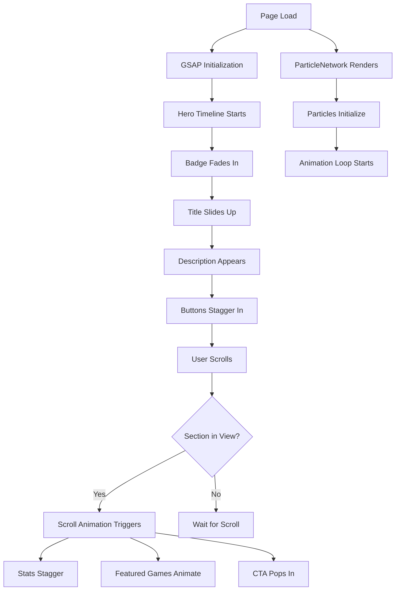
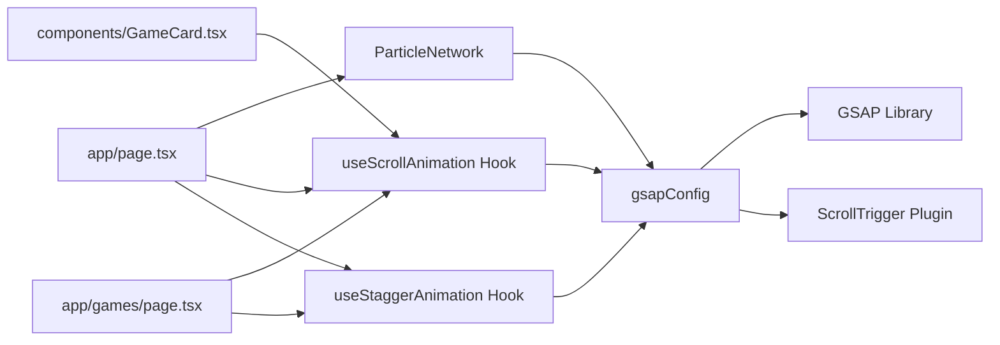

# GSAP Animations & Particle Effects Implementation Plan

## Overview
This plan outlines the implementation of GSAP animations throughout the GameFI catalog website and the addition of a blockchain-themed particle network effect in the hero section.

## Current State Analysis

### Existing Page Blocks
Based on [`app/page.tsx`](../app/page.tsx), the homepage contains these main sections:
1. **Hero Section** (lines 15-52) - Main landing area with title, description, and CTAs
2. **Stats Ticker** (lines 54-72) - 4 statistics cards in a grid
3. **Featured Games** (lines 74-112) - Grid of 6 featured game cards
4. **CTA Section** (lines 114-130) - Call-to-action block at bottom

Additional pages:
- **Games Catalog** ([`app/games/page.tsx`](../app/games/page.tsx)) - Filterable game grid
- **Individual Game Cards** ([`components/GameCard.tsx`](../components/GameCard.tsx)) - Reusable card component

### Current Styling
- Next.js 15 with TypeScript
- Tailwind CSS for styling
- Custom animations in [`app/globals.css`](../app/globals.css): `float`, `pulse-glow`, `border-glow`
- Dark theme with Bitcoin orange (#F7931A) and gold accents

## Implementation Strategy

### 1. GSAP Setup

#### Libraries to Install
```bash
npm install gsap @gsap/react
```

**Packages:**
- `gsap` - Main GSAP library
- `@gsap/react` - React-specific hooks and components

**Plugins to use:**
- `ScrollTrigger` - For scroll-based animations
- `gsap.timeline()` - For sequenced animations
- `gsap.to()`, `gsap.from()`, `gsap.fromTo()` - Core animation methods

#### File Structure
```
lib/
  animations/
    gsapConfig.ts         # GSAP registration and global config
    useScrollAnimation.ts # Custom hook for scroll animations
    useStaggerAnimation.ts # Custom hook for stagger animations
    
components/
  animations/
    ParticleNetwork.tsx   # Blockchain particle effect component
```

---

### 2. Particle Network Component

#### Component: `components/animations/ParticleNetwork.tsx`

**Features:**
- Canvas-based particle system using HTML5 Canvas API
- Particles with randomized positions and velocities
- Dynamic line connections when particles are within threshold distance
- Responsive to container size
- Performance optimized with requestAnimationFrame
- Integration with GSAP for smooth animations

**Technical Specifications:**
```typescript
interface Particle {
  x: number
  y: number
  vx: number  // velocity X
  vy: number  // velocity Y
  radius: number
  opacity: number
}

Config:
- Particle count: 50-80 (responsive to screen size)
- Particle size: 2-4px with glow effect
- Connection distance: 120px
- Colors: Bitcoin orange (#F7931A) with opacity gradient
- Movement speed: 0.2-0.5px per frame
- Boundaries: Wrap around edges
```

**Visual Design:**
- Particles: Small circles with radial gradient (orange glow)
- Connections: Lines with opacity based on distance (closer = more opaque)
- Background: Transparent (overlay on existing hero gradients)
- Z-index: Between grid pattern and content

**Props:**
```typescript
interface ParticleNetworkProps {
  particleCount?: number
  connectionDistance?: number
  particleColor?: string
  lineColor?: string
  particleSize?: number
  speed?: number
}
```

---

### 3. GSAP Animation Patterns

#### Pattern 1: Scroll-Triggered Fade & Slide Up
**Use Cases:** Section titles, content blocks, CTA cards

```typescript
gsap.from(element, {
  scrollTrigger: {
    trigger: element,
    start: "top 80%",      // Start when element is 80% from top
    end: "top 20%",        // End animation
    toggleActions: "play none none reverse"
  },
  y: 50,                   // Start 50px below
  opacity: 0,              // Start invisible
  duration: 0.8,
  ease: "power3.out"
})
```

#### Pattern 2: Stagger Animation for Grid Items
**Use Cases:** Game cards, stats cards

```typescript
gsap.from(elements, {
  scrollTrigger: {
    trigger: container,
    start: "top 70%"
  },
  y: 30,
  opacity: 0,
  duration: 0.6,
  stagger: 0.1,           // 0.1s delay between each item
  ease: "power2.out"
})
```

#### Pattern 3: Timeline Sequence
**Use Cases:** Hero section (badge → title → description → buttons)

```typescript
const tl = gsap.timeline({ defaults: { ease: "power3.out" }})

tl.from(badge, { y: -20, opacity: 0, duration: 0.6 })
  .from(title, { y: 30, opacity: 0, duration: 0.8 }, "-=0.3")
  .from(description, { y: 20, opacity: 0, duration: 0.6 }, "-=0.4")
  .from(buttons, { y: 20, opacity: 0, duration: 0.6, stagger: 0.1 }, "-=0.3")
```

#### Pattern 4: Scale & Glow on Hover
**Use Cases:** Game cards, buttons (enhancement)

```typescript
gsap.to(element, {
  scale: 1.05,
  boxShadow: "0 0 30px rgba(247, 147, 26, 0.4)",
  duration: 0.3,
  ease: "power2.out"
})
```

---

### 4. Animation Implementation by Section

#### 4.1 Hero Section ([`app/page.tsx`](../app/page.tsx:15-52))

**Elements to Animate:**
1. **Badge** (line 25-30): Fade in from top
2. **Title** (line 32-35): Fade in + slide up with gradient reveal
3. **Description** (line 37-40): Fade in + slide up
4. **Buttons** (line 42-50): Fade in + slide up with stagger

**Animation Timeline:**
- Total sequence: ~2 seconds
- Badge appears first (0-0.6s)
- Title overlaps at 0.3s (0.3-1.1s)
- Description overlaps at 0.7s (0.7-1.3s)
- Buttons overlap at 1.0s (1.0-1.6s)

**Particle Network:**
- Rendered between gradient orbs and content (z-index management)
- Full hero section coverage
- Particles animate continuously
- GSAP handles initial fade-in of canvas

**Code Structure:**
```tsx
'use client'
import { useRef, useEffect } from 'react'
import { gsap } from 'gsap'
import ParticleNetwork from '@/components/animations/ParticleNetwork'

export default function HomePage() {
  const heroRef = useRef(null)
  const badgeRef = useRef(null)
  const titleRef = useRef(null)
  // ... other refs
  
  useEffect(() => {
    // GSAP timeline animation
  }, [])
  
  return (
    <section ref={heroRef}>
      <ParticleNetwork />
      {/* ... existing content with refs */}
    </section>
  )
}
```

#### 4.2 Stats Ticker ([`app/page.tsx`](../app/page.tsx:54-72))

**Animation:**
- Scroll-triggered stagger animation
- Each stat card fades in and slides up sequentially
- Icon scales and glows slightly
- Counter animation (optional enhancement)

**Trigger Point:** When section is 70% visible

**Implementation:**
```tsx
useEffect(() => {
  gsap.from('.stat-card', {
    scrollTrigger: {
      trigger: '.stats-section',
      start: 'top 70%'
    },
    y: 40,
    opacity: 0,
    scale: 0.9,
    duration: 0.6,
    stagger: 0.15,
    ease: 'back.out(1.2)'
  })
}, [])
```

#### 4.3 Featured Games Section ([`app/page.tsx`](../app/page.tsx:74-112))

**Elements:**
1. **Section Title** (line 77-83): Fade in + slide up
2. **Game Cards Grid** (line 88-97): Stagger animation
3. **View All Button** (line 99-104): Fade in

**Animation Sequence:**
1. Title appears when section is 75% visible
2. After 0.2s delay, cards stagger in (0.12s between each)
3. Button fades in after cards complete

**Code Approach:**
```tsx
// Title animation
gsap.from(titleRef.current, {
  scrollTrigger: { trigger: sectionRef.current, start: 'top 75%' },
  y: 30,
  opacity: 0,
  duration: 0.7
})

// Cards stagger
gsap.from('.game-card', {
  scrollTrigger: { trigger: sectionRef.current, start: 'top 70%' },
  y: 50,
  opacity: 0,
  scale: 0.95,
  duration: 0.6,
  stagger: 0.12,
  delay: 0.2
})
```

#### 4.4 CTA Section ([`app/page.tsx`](../app/page.tsx:114-130))

**Animation:**
- Card slides up and fades in with a "pop" effect
- Slight bounce easing
- Glow intensifies on appearance

**Trigger:** 80% visibility

```tsx
gsap.from(ctaRef.current, {
  scrollTrigger: { trigger: ctaRef.current, start: 'top 80%' },
  y: 60,
  opacity: 0,
  scale: 0.95,
  duration: 0.8,
  ease: 'back.out(1.4)'
})
```

#### 4.5 Games Catalog Page ([`app/games/page.tsx`](../app/games/page.tsx))

**Elements:**
1. Page header/title: Fade in + slide down
2. Filter panel: Fade in + slide from left
3. Game grid: Stagger animation similar to featured games

#### 4.6 GameCard Component Enhancement ([`components/GameCard.tsx`](../components/GameCard.tsx))

**Hover Animations (GSAP-based):**
- Image scale with parallax effect
- Card lift with enhanced shadow
- Badge pulse effect

**Note:** Keep existing Tailwind transitions, enhance with GSAP for complex interactions

---

### 5. Custom Hooks

#### Hook 1: `useScrollAnimation`
```typescript
import { useEffect, RefObject } from 'react'
import { gsap } from 'gsap'
import { ScrollTrigger } from 'gsap/ScrollTrigger'

interface ScrollAnimationOptions {
  trigger: RefObject<HTMLElement>
  start?: string
  end?: string
  animation: gsap.TweenVars
}

export const useScrollAnimation = (options: ScrollAnimationOptions) => {
  useEffect(() => {
    if (!options.trigger.current) return
    
    const animation = gsap.from(options.trigger.current, {
      scrollTrigger: {
        trigger: options.trigger.current,
        start: options.start || 'top 80%',
        end: options.end || 'top 20%',
        toggleActions: 'play none none reverse'
      },
      ...options.animation
    })
    
    return () => animation.kill()
  }, [])
}
```

#### Hook 2: `useStaggerAnimation`
```typescript
interface StaggerAnimationOptions {
  containerRef: RefObject<HTMLElement>
  selector: string
  animation: gsap.TweenVars
  stagger?: number
  scrollTriggerOptions?: ScrollTrigger.Vars
}

export const useStaggerAnimation = (options: StaggerAnimationOptions) => {
  useEffect(() => {
    if (!options.containerRef.current) return
    
    const elements = options.containerRef.current.querySelectorAll(options.selector)
    
    const animation = gsap.from(elements, {
      scrollTrigger: {
        trigger: options.containerRef.current,
        start: 'top 70%',
        ...options.scrollTriggerOptions
      },
      ...options.animation,
      stagger: options.stagger || 0.1
    })
    
    return () => animation.kill()
  }, [])
}
```

---

### 6. Performance Optimization

#### Best Practices:
1. **Ref Management:** Use `useRef` for all animated elements to avoid targeting by CSS selectors
2. **Cleanup:** Always return cleanup functions in `useEffect` to kill animations
3. **Conditional Rendering:** Don't initialize GSAP until elements are mounted
4. **ScrollTrigger Refresh:** Call `ScrollTrigger.refresh()` after dynamic content loads
5. **Will-change CSS:** Add `will-change: transform, opacity` to animated elements
6. **Reduced Motion:** Respect `prefers-reduced-motion` media query

#### Particle Network Optimization:
- Limit particle count on mobile (30-40 vs 60-80 on desktop)
- Use `requestAnimationFrame` with throttling
- Pause animation when tab is not visible
- Clear canvas efficiently (avoid full redraws)
- Use object pooling for particle instances

#### GSAP Optimization:
```typescript
// Set default GSAP config
gsap.defaults({
  ease: 'power3.out',
  duration: 0.6
})

// Use force3D for better performance
gsap.set(element, { force3D: true })

// Lazy load ScrollTrigger
import('gsap/ScrollTrigger').then(({ ScrollTrigger }) => {
  gsap.registerPlugin(ScrollTrigger)
})
```

---

### 7. Accessibility Considerations

#### Respect User Preferences:
```typescript
const prefersReducedMotion = window.matchMedia('(prefers-reduced-motion: reduce)').matches

if (prefersReducedMotion) {
  // Disable animations or use instant transitions
  gsap.set(element, { opacity: 1, y: 0 })
} else {
  // Normal animations
  gsap.from(element, { opacity: 0, y: 50, duration: 0.8 })
}
```

#### Focus Management:
- Ensure animated elements don't interfere with keyboard navigation
- Maintain focus visibility during animations
- Don't animate during form interactions

---

### 8. Testing Strategy

#### Visual Testing:
1. Test on different screen sizes (mobile, tablet, desktop)
2. Verify animation timing and smoothness
3. Check particle network performance on lower-end devices
4. Test scroll behavior with fast/slow scrolling
5. Verify animations work with browser back/forward navigation

#### Performance Metrics:
- FPS should stay above 60 during animations
- Particle network should not impact page load time
- Monitor memory usage for canvas element
- Check Lighthouse scores (performance should stay above 90)

#### Browser Testing:
- Chrome/Edge (Chromium)
- Firefox
- Safari (mobile and desktop)
- Test with hardware acceleration disabled

---

## Implementation Order

### Phase 1: Foundation
1. Install GSAP libraries
2. Create animation utility files and hooks
3. Setup GSAP configuration and registration

### Phase 2: Particle Network
1. Build ParticleNetwork component
2. Test canvas rendering and performance
3. Integrate into hero section

### Phase 3: Homepage Animations
1. Hero section timeline animation
2. Stats ticker stagger animation
3. Featured games section animations
4. CTA section animation

### Phase 4: Additional Pages
1. Games catalog page animations
2. GameCard hover enhancements
3. Individual game page animations (if needed)

### Phase 5: Polish & Testing
1. Performance optimization
2. Accessibility improvements
3. Cross-browser testing
4. Mobile optimization

---

## Code Examples

### Example 1: ParticleNetwork Component Structure
```tsx
'use client'
import { useEffect, useRef } from 'react'

interface ParticleNetworkProps {
  particleCount?: number
  connectionDistance?: number
}

export default function ParticleNetwork({ 
  particleCount = 60, 
  connectionDistance = 120 
}: ParticleNetworkProps) {
  const canvasRef = useRef<HTMLCanvasElement>(null)
  const particlesRef = useRef<Particle[]>([])
  const animationIdRef = useRef<number>()
  
  useEffect(() => {
    const canvas = canvasRef.current
    if (!canvas) return
    
    const ctx = canvas.getContext('2d')
    if (!ctx) return
    
    // Initialize particles
    // Animation loop
    // Cleanup
    
    return () => {
      if (animationIdRef.current) {
        cancelAnimationFrame(animationIdRef.current)
      }
    }
  }, [particleCount, connectionDistance])
  
  return (
    <canvas 
      ref={canvasRef}
      className="absolute inset-0 pointer-events-none"
      style={{ zIndex: 1 }}
    />
  )
}
```

### Example 2: Hero Section with GSAP
```tsx
'use client'
import { useRef, useEffect } from 'react'
import gsap from 'gsap'
import ParticleNetwork from '@/components/animations/ParticleNetwork'

export default function HomePage() {
  const badgeRef = useRef<HTMLDivElement>(null)
  const titleRef = useRef<HTMLHeadingElement>(null)
  const descRef = useRef<HTMLParagraphElement>(null)
  const buttonsRef = useRef<HTMLDivElement>(null)
  
  useEffect(() => {
    const tl = gsap.timeline({ defaults: { ease: 'power3.out' } })
    
    tl.from(badgeRef.current, { 
      y: -20, 
      opacity: 0, 
      duration: 0.6 
    })
    .from(titleRef.current, { 
      y: 30, 
      opacity: 0, 
      duration: 0.8 
    }, '-=0.3')
    .from(descRef.current, { 
      y: 20, 
      opacity: 0, 
      duration: 0.6 
    }, '-=0.4')
    .from(buttonsRef.current?.children || [], { 
      y: 20, 
      opacity: 0, 
      duration: 0.6, 
      stagger: 0.1 
    }, '-=0.3')
  }, [])
  
  return (
    <section className="relative min-h-[600px]">
      <ParticleNetwork particleCount={60} connectionDistance={120} />
      
      <div ref={badgeRef}>{/* Badge content */}</div>
      <h1 ref={titleRef}>{/* Title */}</h1>
      <p ref={descRef}>{/* Description */}</p>
      <div ref={buttonsRef}>{/* Buttons */}</div>
    </section>
  )
}
```

---

## Visual Diagram: Animation Flow



---

## Mermaid Diagram: Component Structure



---

## File Changes Summary

### New Files:
1. `lib/animations/gsapConfig.ts` - GSAP setup and registration
2. `lib/animations/useScrollAnimation.ts` - Scroll animation hook
3. `lib/animations/useStaggerAnimation.ts` - Stagger animation hook
4. `components/animations/ParticleNetwork.tsx` - Particle effect component
5. `plans/gsap-animations-plan.md` - This document

### Modified Files:
1. `app/page.tsx` - Add refs, GSAP animations, ParticleNetwork
2. `app/games/page.tsx` - Add scroll animations
3. `components/GameCard.tsx` - Add GSAP hover effects (optional)
4. `app/layout.tsx` - GSAP registration (if global)
5. `package.json` - Add GSAP dependencies
6. `app/globals.css` - Add will-change properties for performance

---

## Estimated Complexity

- **GSAP Installation & Setup:** Simple
- **ParticleNetwork Component:** Medium (canvas API complexity)
- **Hero Section Animations:** Simple to Medium
- **Scroll-triggered Animations:** Simple (with hooks)
- **Stagger Animations:** Simple (with hooks)
- **Performance Optimization:** Medium
- **Cross-browser Testing:** Medium

---

## Success Criteria

✅ All page blocks have smooth, professional animations  
✅ Particle network renders correctly with blockchain connection effect  
✅ Animations are scroll-triggered appropriately  
✅ Stagger effects create visual hierarchy  
✅ Performance remains excellent (60fps, Lighthouse 90+)  
✅ Animations respect reduced motion preference  
✅ No layout shift or janky animations  
✅ Works across all modern browsers  
✅ Mobile-optimized with reduced particle count  

---

## Notes

- Consider adding GSAP's `SplitText` plugin for advanced text animations (licensed)
- Particle network could be extended with mouse interaction in future
- Animation duration and easing can be fine-tuned based on user feedback
- Consider adding loading state animations for dynamic content
- Keep animation library modular for easy maintenance and updates
