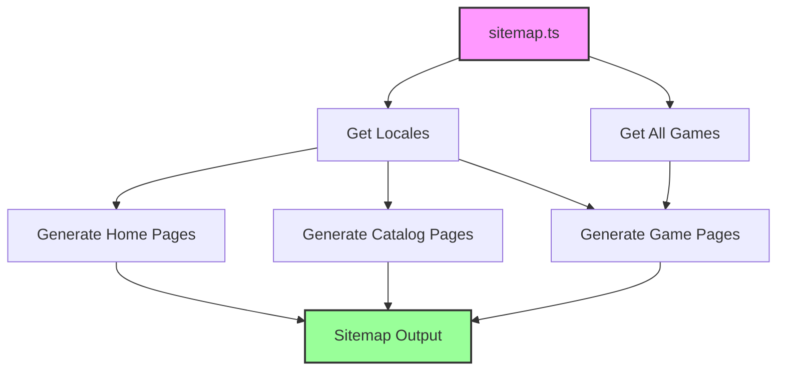

# Multilingual Sitemap Implementation Plan

## Current State Analysis

### Issues Identified

1. **Missing Locale-Specific URLs**
   - Current [`sitemap.ts`](../app/sitemap.ts:6) generates only base URLs without locale prefixes
   - Example: Currently generates `/games/{slug}` instead of `/en/games/{slug}`, `/ua/games/{slug}`, `/ru/games/{slug}`

2. **Configuration Inconsistency**
   - [`i18n.ts`](../i18n.ts:8) sets `defaultLocale = 'ua'`
   - [`i18n/request.ts`](../i18n/request.ts:5) sets `defaultLocale = 'en'`
   - This inconsistency needs resolution

3. **Incomplete URL Coverage**
   - Missing home pages for each locale
   - Missing `/games` catalog page for each locale
   - Game detail pages only in default language

4. **No Alternate Language Indicators**
   - Sitemap doesn't indicate alternate language versions
   - Missing hreflang-like structure in sitemap

### Current Supported Locales
- English (en)
- Ukrainian (ua) 
- Russian (ru)

### Current URL Structure
```
❌ Current (Incorrect):
/
/games
/games/{slug}

✅ Should Be:
/en (home)
/ua (home) 
/ru (home)
/en/games
/ua/games
/ru/games
/en/games/{slug}
/ua/games/{slug}
/ru/games/{slug}
```

## Proposed Implementation

### Architecture Overview



### File Changes Required

#### 1. Fix Configuration Consistency
**File:** [`i18n/request.ts`](../i18n/request.ts:5)
- Change `defaultLocale` from 'en' to 'ua' to match [`i18n.ts`](../i18n.ts:8)
- OR update [`i18n.ts`](../i18n.ts:8) to 'en' if English should be default
- **Decision needed:** Which locale should be the default?

#### 2. Update Sitemap Generation
**File:** [`app/sitemap.ts`](../app/sitemap.ts:1)

**Changes:**
- Import locale configuration from i18n
- Generate home page URLs for each locale
- Generate catalog page URLs for each locale
- Generate game detail page URLs for all locales and all games
- Set appropriate priorities and change frequencies

**Priority Structure:**
```
Home pages (each locale): 1.0
Catalog pages (each locale): 0.9
Game detail pages: 0.8
```

**Change Frequency:**
```
Home pages: daily
Catalog pages: daily
Game detail pages: weekly
```

### Sitemap URL Structure

#### Home Pages (3 URLs)
```
/en
/ua
/ru
```

#### Catalog Pages (3 URLs)
```
/en/games
/ua/games
/ru/games
```

#### Game Detail Pages (N games × 3 locales)
```
/en/games/{slug}
/ua/games/{slug}
/ru/games/{slug}
```

**Example with 20 games:**
- 3 home pages
- 3 catalog pages  
- 60 game pages (20 games × 3 locales)
- **Total: 66 URLs**

### Implementation Code Structure

```typescript
import { MetadataRoute } from 'next'
import { getAllGames } from '@/lib/data'
import { locales } from '@/i18n'

export const dynamic = 'force-static'

export default function sitemap(): MetadataRoute.Sitemap {
  const baseUrl = 'https://gamefi.ua'
  const games = getAllGames()
  
  const sitemapEntries: MetadataRoute.Sitemap = []
  
  // For each locale, generate all page types
  locales.forEach(locale => {
    // Home pages
    sitemapEntries.push({
      url: `${baseUrl}/${locale}`,
      lastModified: new Date(),
      changeFrequency: 'daily',
      priority: 1.0,
    })
    
    // Catalog pages
    sitemapEntries.push({
      url: `${baseUrl}/${locale}/games`,
      lastModified: new Date(),
      changeFrequency: 'daily',
      priority: 0.9,
    })
    
    // Game detail pages
    games.forEach(game => {
      sitemapEntries.push({
        url: `${baseUrl}/${locale}/games/${game.slug}`,
        lastModified: new Date(),
        changeFrequency: 'weekly',
        priority: 0.8,
      })
    })
  })
  
  return sitemapEntries
}
```

## Validation Checklist

### Before Implementation
- [x] Document current issues
- [x] Identify all required URL patterns
- [x] Define priority and frequency structure
- [ ] Decide on default locale consistency

### After Implementation
- [ ] Verify all locale home pages are included
- [ ] Verify all locale catalog pages are included
- [ ] Verify all game pages for all locales are included
- [ ] Check correct priorities are set
- [ ] Check correct changeFrequency values
- [ ] Validate sitemap.xml is accessible at /sitemap.xml
- [ ] Test sitemap with Google Search Console validator
- [ ] Verify XML format is valid
- [ ] Check file size is reasonable (under 50MB, under 50k URLs)

### Testing Steps

1. **Build the sitemap:**
   ```bash
   npm run build
   ```

2. **Check sitemap output:**
   - Navigate to `http://localhost:3000/sitemap.xml`
   - Verify structure and URLs

3. **Validate XML:**
   - Use online XML validator
   - Check for syntax errors

4. **Count URLs:**
   - Should have: (number_of_games × 3) + 6 URLs
   - Verify count matches expectation

5. **Check priorities:**
   - Home pages: 1.0
   - Catalog pages: 0.9
   - Game pages: 0.8

## SEO Best Practices

### Sitemap Standards
- ✅ All URLs should be absolute (include domain)
- ✅ Use HTTPS protocol
- ✅ Include lastModified dates
- ✅ Set appropriate priorities (0.0-1.0)
- ✅ Set realistic changeFrequency values
- ✅ Keep under 50MB and 50,000 URLs per sitemap

### Multilingual SEO
- ✅ Include all language versions of pages
- ✅ Use consistent URL structure across locales
- ✅ Ensure hreflang tags in page metadata (already done in layout.tsx)
- ✅ All localized pages indexed separately

## Additional Considerations

### robots.txt Integration
Current [`robots.ts`](../app/robots.ts:21) already references sitemap:
```typescript
sitemap: `${baseUrl}/sitemap.xml`
```
✅ This is correct and doesn't need changes.

### Metadata Alternates
[`app/[locale]/layout.tsx`](../app/[locale]/layout.tsx:63-70) already includes alternate language links:
```typescript
alternates: {
  canonical: 'https://gamefi.ua',
  languages: {
    'en': 'https://gamefi.ua/en',
    'uk': 'https://gamefi.ua/ua',
    'ru': 'https://gamefi.ua/ru'
  }
}
```
✅ This works well with the sitemap structure.

### Middleware Configuration
[`middleware.ts`](../middleware.ts:7) uses `localePrefix: 'always'`:
```typescript
localePrefix: 'always'
```
✅ This ensures all URLs have locale prefix, matching sitemap structure.

## Expected Outcome

After implementation:
1. Sitemap will include all pages for all supported locales
2. Search engines can discover and index all language versions
3. Each locale's pages will be properly prioritized
4. URL structure will match actual routing in the application
5. Configuration will be consistent across all i18n files

## Timeline & Dependencies

### No External Dependencies
All changes can be made with existing tools and libraries.

### Files to Modify
1. [`app/sitemap.ts`](../app/sitemap.ts:1) - Main implementation
2. [`i18n/request.ts`](../i18n/request.ts:5) OR [`i18n.ts`](../i18n.ts:8) - Fix default locale consistency

### Testing Requirements
- Local development server for testing
- Build process to generate static sitemap
- Browser or curl to view sitemap.xml
- Optional: Google Search Console for validation

## Questions for Clarification

1. **Default Locale**: Should it be 'ua' or 'en'?
   - Currently `i18n.ts` says 'ua' 
   - Currently `i18n/request.ts` says 'en'
   - Need to align both files

2. **Root URL Behavior**: Where should `/` (root without locale) redirect?
   - Based on middleware config with `localePrefix: 'always'`, it should redirect to default locale
   - Need to confirm expected behavior

3. **Sitemap Indexing**: With ~66 URLs (for 20 games), single sitemap is fine. If game count grows significantly:
   - Consider sitemap index file
   - Split into multiple sitemaps (e.g., one per locale)
   - Current approach is suitable for up to ~1000 games

## Next Steps

1. Get clarification on default locale configuration
2. Implement sitemap changes
3. Test locally
4. Validate XML structure
5. Deploy and verify in production
6. Submit to Google Search Console
