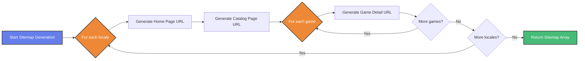
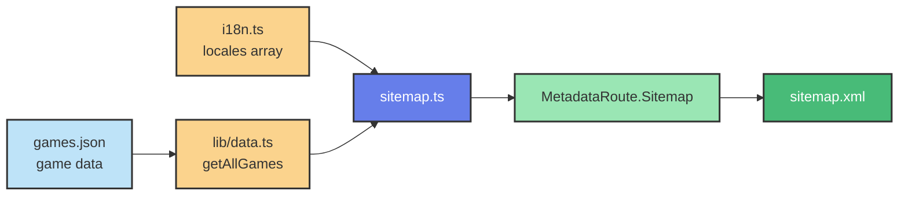
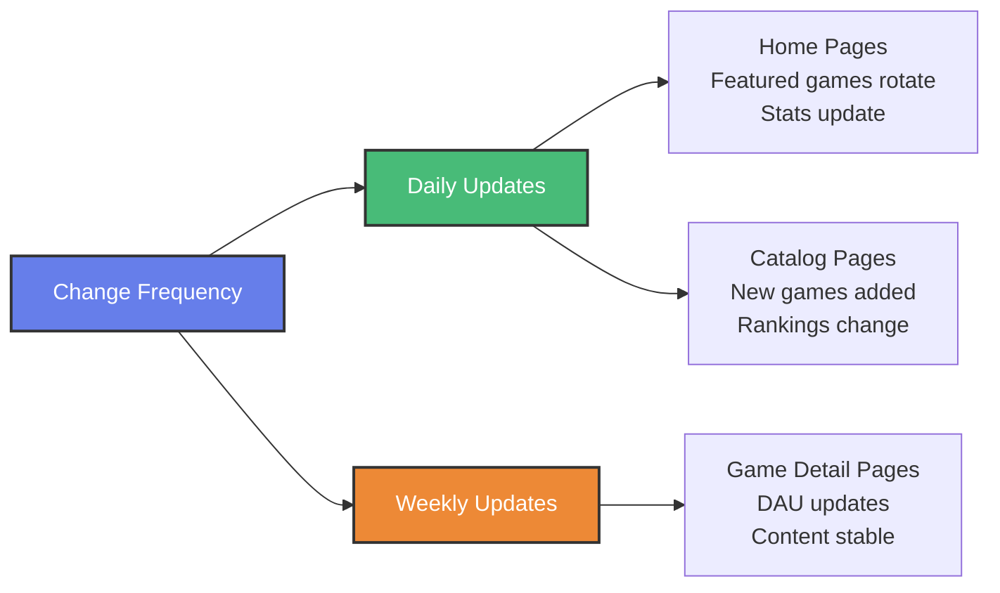
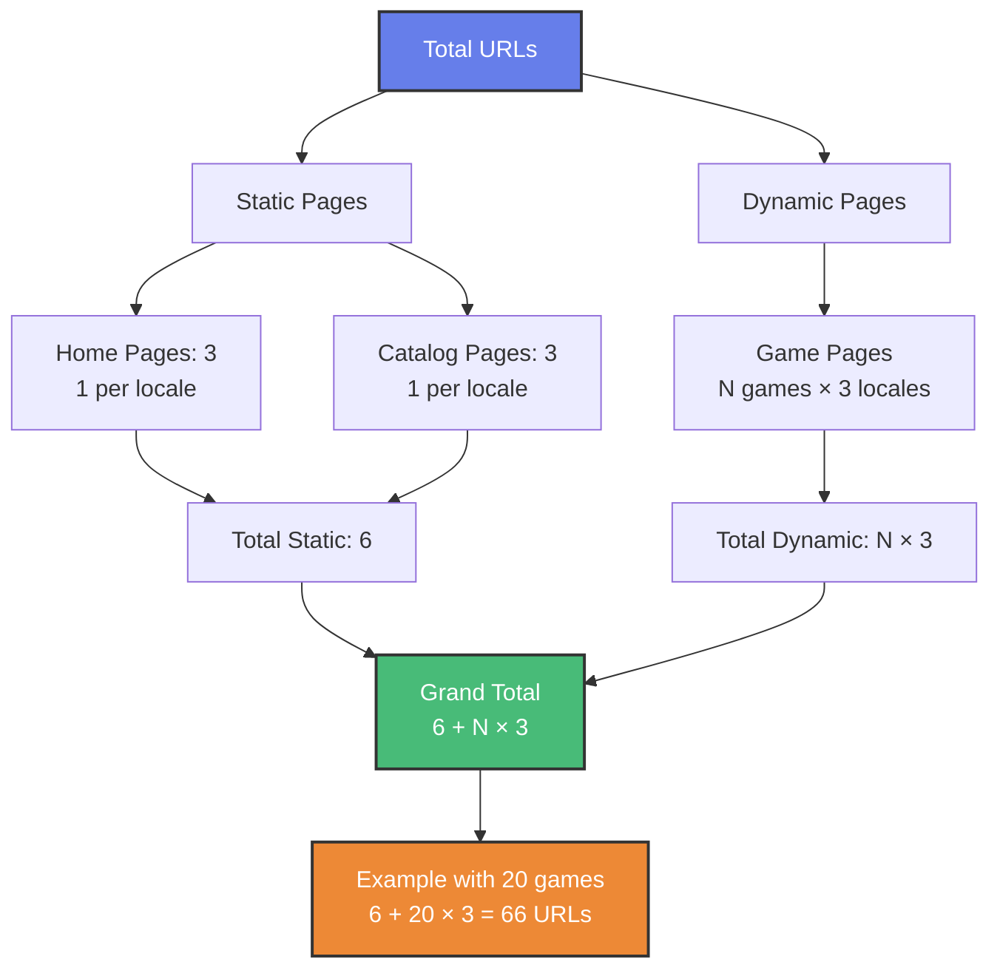
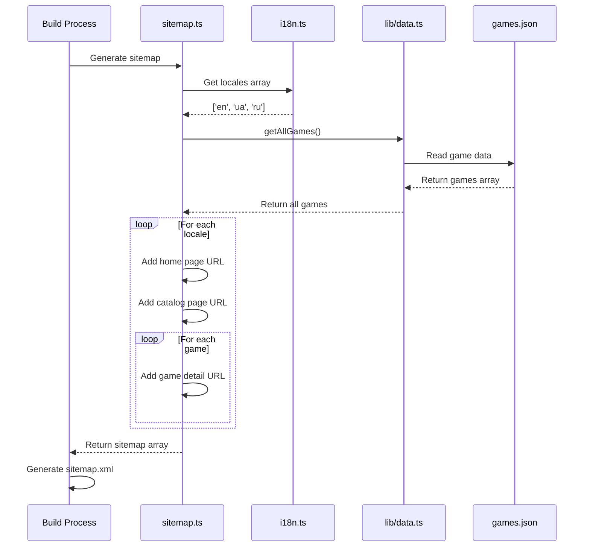
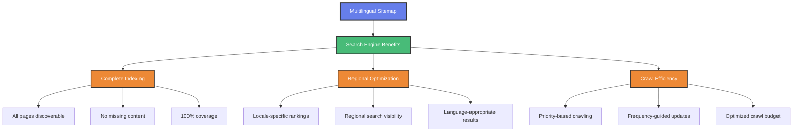
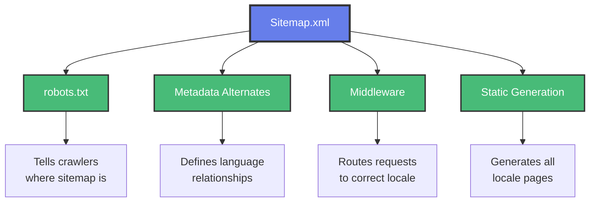
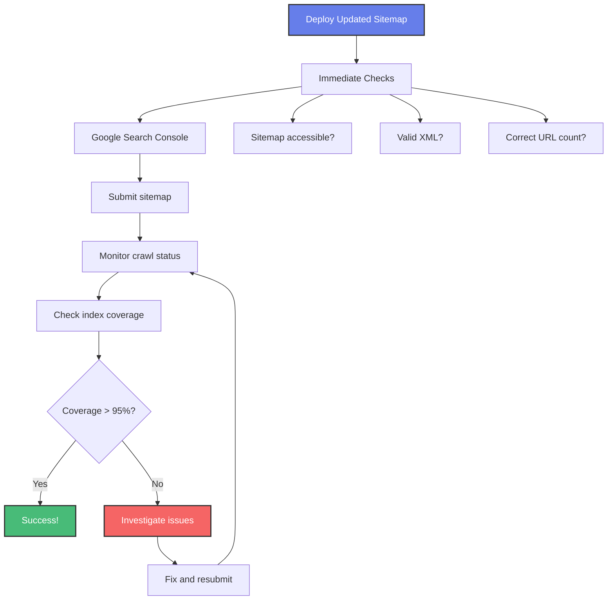

# Multilingual Sitemap Structure Visualization

## Sitemap URL Hierarchy

```mermaid
graph TB
    Root[Sitemap.xml] --> EN[English Locale]
    Root --> UA[Ukrainian Locale]
    Root --> RU[Russian Locale]
    
    EN --> EN_Home[/en<br/>Priority: 1.0<br/>Frequency: daily]
    EN --> EN_Games[/en/games<br/>Priority: 0.9<br/>Frequency: daily]
    EN --> EN_Game1[/en/games/game-1<br/>Priority: 0.8<br/>Frequency: weekly]
    EN --> EN_Game2[/en/games/game-2<br/>Priority: 0.8<br/>Frequency: weekly]
    EN --> EN_GameN[/en/games/game-n<br/>Priority: 0.8<br/>Frequency: weekly]
    
    UA --> UA_Home[/ua<br/>Priority: 1.0<br/>Frequency: daily]
    UA --> UA_Games[/ua/games<br/>Priority: 0.9<br/>Frequency: daily]
    UA --> UA_Game1[/ua/games/game-1<br/>Priority: 0.8<br/>Frequency: weekly]
    UA --> UA_Game2[/ua/games/game-2<br/>Priority: 0.8<br/>Frequency: weekly]
    UA --> UA_GameN[/ua/games/game-n<br/>Priority: 0.8<br/>Frequency: weekly]
    
    RU --> RU_Home[/ru<br/>Priority: 1.0<br/>Frequency: daily]
    RU --> RU_Games[/ru/games<br/>Priority: 0.9<br/>Frequency: daily]
    RU --> RU_Game1[/ru/games/game-1<br/>Priority: 0.8<br/>Frequency: weekly]
    RU --> RU_Game2[/ru/games/game-2<br/>Priority: 0.8<br/>Frequency: weekly]
    RU --> RU_GameN[/ru/games/game-n<br/>Priority: 0.8<br/>Frequency: weekly]
    
    style Root fill:#667eea,stroke:#333,stroke-width:3px,color:#fff
    style EN fill:#48bb78,stroke:#333,stroke-width:2px,color:#fff
    style UA fill:#ed8936,stroke:#333,stroke-width:2px,color:#fff
    style RU fill:#f56565,stroke:#333,stroke-width:2px,color:#fff
```

## URL Generation Flow



## Data Flow Architecture



## Priority Hierarchy

```mermaid
graph TD
    A[Page Priority Structure] --> B[Priority 1.0<br/>Home Pages]
    A --> C[Priority 0.9<br/>Catalog Pages]
    A --> D[Priority 0.8<br/>Game Detail Pages]
    
    B --> B1[/en]
    B --> B2[/ua]
    B --> B3[/ru]
    
    C --> C1[/en/games]
    C --> C2[/ua/games]
    C --> C3[/ru/games]
    
    D --> D1[All game pages<br/>in all locales]
    
    style A fill:#667eea,stroke:#333,stroke-width:3px,color:#fff
    style B fill:#48bb78,stroke:#333,stroke-width:2px,color:#fff
    style C fill:#ed8936,stroke:#333,stroke-width:2px,color:#fff
    style D fill:#f6ad55,stroke:#333,stroke-width:2px,color:#fff
```

## Change Frequency Strategy



## URL Count Calculation



## Implementation Sequence



## SEO Impact Visualization



## Before vs After Comparison

### Before Update
```
sitemap.xml
├── / (no locale)
├── /games (no locale)
├── /games/hamster-kombat (no locale)
├── /games/pixels (no locale)
└── ... (other games, no locale)
```

### After Update
```
sitemap.xml
├── /en (Home - English)
├── /en/games (Catalog - English)
├── /en/games/hamster-kombat (Game - English)
├── /en/games/pixels (Game - English)
├── ...
├── /ua (Home - Ukrainian)
├── /ua/games (Catalog - Ukrainian)
├── /ua/games/hamster-kombat (Game - Ukrainian)
├── /ua/games/pixels (Game - Ukrainian)
├── ...
├── /ru (Home - Russian)
├── /ru/games (Catalog - Russian)
├── /ru/games/hamster-kombat (Game - Russian)
├── /ru/games/pixels (Game - Russian)
└── ...
```

## Integration with Existing Systems



## Example URLs with Real Data

### Home Pages
```
✅ https://gamefi.ua/en
✅ https://gamefi.ua/ua  (default)
✅ https://gamefi.ua/ru
```

### Catalog Pages
```
✅ https://gamefi.ua/en/games
✅ https://gamefi.ua/ua/games
✅ https://gamefi.ua/ru/games
```

### Game Detail Pages Sample
```
✅ https://gamefi.ua/en/games/hamster-kombat
✅ https://gamefi.ua/ua/games/hamster-kombat
✅ https://gamefi.ua/ru/games/hamster-kombat

✅ https://gamefi.ua/en/games/pixels
✅ https://gamefi.ua/ua/games/pixels
✅ https://gamefi.ua/ru/games/pixels

✅ https://gamefi.ua/en/games/axie-infinity
✅ https://gamefi.ua/ua/games/axie-infinity
✅ https://gamefi.ua/ru/games/axie-infinity
```

## Monitoring & Validation Flow


